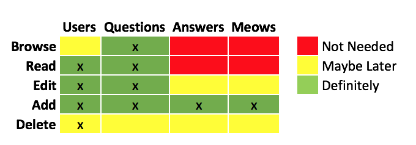

# Introduction

API for the Cat Overflow application.

## Description
Use our API to ask questions, post answers, give meows to answers and questions.

Database mode: https://www.lucidchart.com/documents/view/344365a8-55c7-4977-8b7b-3a4da4cb3a49

## Usage
API Documentation:  https://cats-overflow.herokuapp.com

BREAD model:

